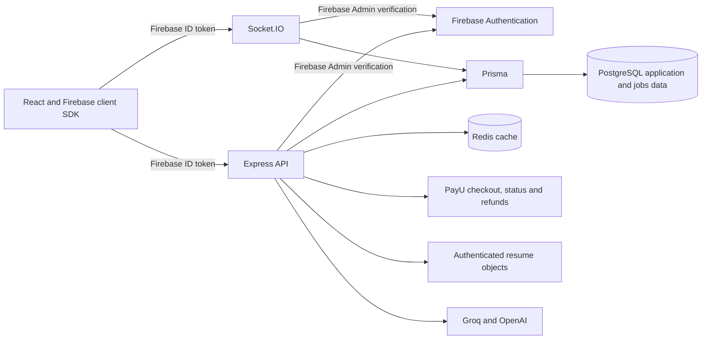

# Architecture and local setup

## Running system



The API verifies each Firebase ID token, including revocation, then loads the current PostgreSQL user by the token's UID. Role, account status and ownership come from PostgreSQL. Sign-in and registration reconcile that row idempotently. Billing, usage, admin, interviews, sessions, jobs and Socket.IO use the same Prisma database. Cloudinary and Firebase deletions are recorded in PostgreSQL cleanup jobs before the corresponding application rows are removed, and a periodic worker retries failed provider calls. MongoDB is used only by migration commands and the isolated legacy regression app; it is not connected by the live server.

## Disposable local verification

Install Node.js 22 and dependencies with `npm ci` in both `api/` and `frontend/`. Start PostgreSQL and Redis with `docker compose up -d`. For migration tests only, start a disposable MongoDB with `docker compose --profile migration up -d mongo`. Start the Firebase Auth Emulator from `api/`:

```powershell
npx --yes firebase-tools@15.31.0 emulators:start --only auth --project demo-interviewmaster
```

Set `FIREBASE_PROJECT_ID=demo-interviewmaster` and `FIREBASE_AUTH_EMULATOR_HOST=127.0.0.1:9099` for the API. Set `VITE_FIREBASE_PROJECT_ID=demo-interviewmaster`, `VITE_FIREBASE_API_KEY=fake-api-key` and `VITE_FIREBASE_AUTH_EMULATOR_URL=http://127.0.0.1:9099` for the frontend. Use only disposable test credentials for the other API settings described in `api/.env.example`. Set `TEST_DATABASE_URL` to a disposable PostgreSQL database named `interviewmaster_test`, and `TEST_BOOTSTRAP_DATABASE_URL` to a separate `interviewmaster_clean_test` database. Apply `npx prisma migrate deploy` and `npx prisma generate` from `api/` before tests.

The legacy regression and migration rehearsal tests also require the `TEST_*_MONGO_URI` settings in `.github/workflows/verify.yml`; these databases are dropped or rewritten by tests. Never point them at application data. Run `npm test`, `npm run typecheck` and `npm run build` from `api/`. Run `npm run lint`, `npm run build` and `npm run test:e2e` from `frontend/`, with the disposable API and Vite server running. Browser tests expect API port 5100 and web port 5175.

## Production gate

Readiness checks PostgreSQL, Redis, PayU configuration and Firebase Admin availability. It does not execute real payments, external AI requests or a migration reconciliation. Before deployment, complete the staging checks in [implementation status](IMPLEMENTATION_STATUS.md), rehearse backup and restore, reconcile every source entity and PayU order, and verify external providers with test credentials. Keep the source backups until cutover results are accepted.
