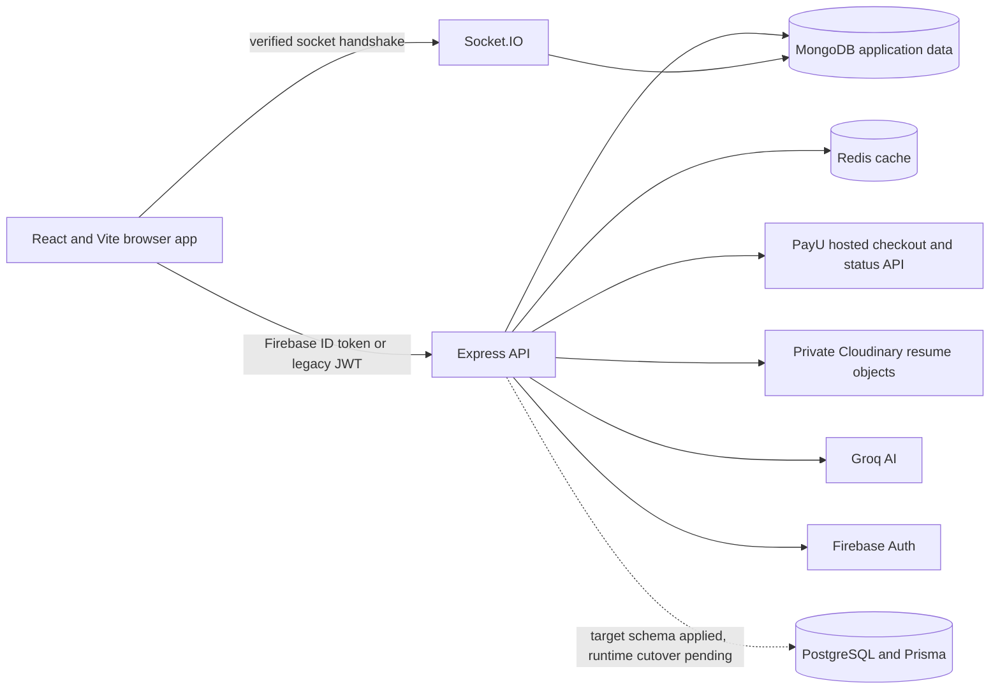

# Architecture and local setup

## Running system



The Firebase branch verifies ID tokens with revocation checks and looks up a MongoDB user by Firebase UID. It never grants a role from the token or links an existing account by email. A user-only migration can also create the matching PostgreSQL row. MongoDB remains the live store for resumes, interviews, sessions, billing, admin and jobs. Some legacy job searches read a separate `jobs` PostgreSQL table and fall back to MongoDB; this is not the final Prisma job-board design.

## Disposable local verification

Install API and frontend dependencies with `npm ci` in each directory. Start MongoDB, PostgreSQL, Redis and the Firebase Auth Emulator. The Auth Emulator can be started from `api/` with:

```powershell
npx --yes firebase-tools@15.31.0 emulators:start --only auth --project demo-interviewmaster
```

Set `AUTH_PROVIDER=firebase`, `FIREBASE_PROJECT_ID=demo-interviewmaster`, `FIREBASE_AUTH_EMULATOR_HOST=127.0.0.1:9099` for the API; set `VITE_AUTH_PROVIDER=firebase`, `VITE_FIREBASE_PROJECT_ID=demo-interviewmaster`, `VITE_FIREBASE_API_KEY=fake-api-key`, and `VITE_FIREBASE_AUTH_EMULATOR_URL=http://127.0.0.1:9099` for the web app. Supply the remaining placeholder API settings from `api/.env.example` for local tests only. In a real deployment, remove the emulator setting and provide actual Firebase Admin credentials. Never use the demo project or test PayU values in production.

Create a disposable PostgreSQL database named `interviewmaster_test`, set `DATABASE_URL` to it and run `npx prisma migrate deploy` from `api/`. Set `TEST_DATABASE_URL` to the same URL. For the integration suite, also set `TEST_MONGO_URI`, `TEST_FIREBASE_MONGO_URI`, `TEST_MIGRATION_MONGO_URI`, and `TEST_SESSION_MONGO_URI` to disposable databases with the exact names shown in their test files. `npm test` drops those MongoDB databases; never point these variables at application data. Run `npm run build` in both packages and `npm run test:e2e` in `frontend/` with the API and Vite dev server running in Firebase mode. The browser test expects API port 5100 and web port 5175 unless edited.

## Production gate

The current readiness probe checks MongoDB, Redis, PayU configuration and Firebase availability in Firebase mode. It does not certify the target PostgreSQL cutover or external PayU/AI/storage journeys. Before production launch, complete the outstanding items in [implementation status](IMPLEMENTATION_STATUS.md), migrate every related record, perform an encrypted backup and restore drill, configure monitoring, run real sandbox payment and refund checks, and run the full candidate and admin browser journeys in staging. Keep the previous application build and data backups until reconciliation is complete.
