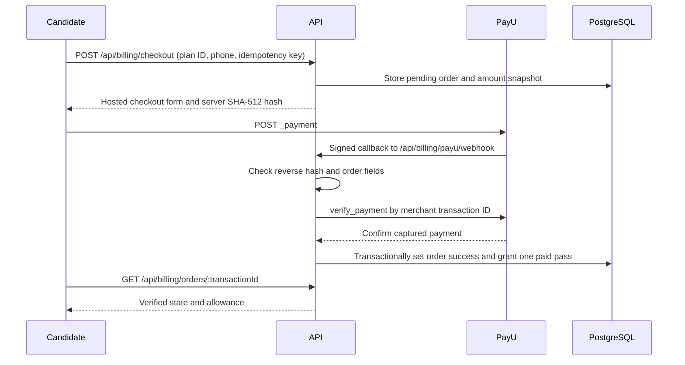

# PayU India billing

## Flow

The browser return uses `/api/billing/payu/return` and redirects to `/billing/result`. It does not itself grant access. `POST /api/billing/payu/webhook` accepts PayU payment callbacks and refund notifications. Payment callbacks require the documented reverse hash and a matching local order. The server also calls `verify_payment`; only `success` with `unmappedstatus=captured`, the original transaction amount, matching plan and user fields, and a PayU payment ID grants a pass. Duplicate callbacks use unique order and subscription keys. A failure cannot replace a confirmed success. The order snapshots the allowance and duration at checkout. A candidate with an active pass cannot start another checkout; paid passes do not renew automatically.

The API also scans unsettled orders every five minutes. It claims at most 20 orders per pass with a PostgreSQL lease, asks PayU for authoritative payment or refund status, and records the last check time. This covers delayed or lost callbacks within seven days. Refund requests without a PayU request ID still require operator reconciliation. The scan is process-scheduled, so it runs after the API starts and is not a Redis worker.

## Setup

1. Copy `api/.env.example` to `api/.env` and `frontend/.env.example` to `frontend/.env`.
2. Set `PAYU_ENV=test`, the **sandbox** merchant key and salt, `API_PUBLIC_URL`, and `CLIENT_URL`. Use a public HTTPS tunnel for sandbox callbacks; PayU cannot POST to your local `localhost` address.
3. In the PayU dashboard, configure **Successful**, **Failed**, and **Refund** payment webhooks to `https://YOUR-API/api/billing/payu/webhook`. The return URL is generated automatically as `https://YOUR-API/api/billing/payu/return`.
4. Start PostgreSQL and Redis, apply Prisma migrations, then run `npm ci && npm run dev` in both `api/` and `frontend/`. The API fails startup for missing required settings; `/api/ready` also reports dependencies.
5. Bootstrap an admin once with `npm run seed:admin` in `api/`. Set a unique email and 16+ character password in the environment first. The script refuses to promote an existing public account. Remove these credentials after bootstrap.
6. Create an INR plan in Admin → Subscription. Price minus direct discount must be at least ₹1. The admin dashboard writes integer `amountMinor` for checkout. Existing plans lacking `amountMinor` are deliberately unavailable until edited.

## Sandbox verification

1. Register a candidate and open `/pricing`. Enter a 10-digit phone number, select a plan, and finish PayU sandbox checkout.
2. Verify the browser result stays pending until PayU confirms. Compare the order ID and amount against PayU's dashboard. Confirm `/api/billing/me` shows the paid pass and its new allowance only after a captured payment.
3. Resend the same webhook in the PayU dashboard; it must not create another pass. Try a failed payment and verify there is no pass.
4. From Admin → Payments, request a full refund. It remains `refund_pending` until PayU's refund status API confirms success. Use **Verify refund** or the refund webhook and confirm access is revoked only on success.
5. Run `npm test` in `api/` with `TEST_DATABASE_URL` pointing to a disposable PostgreSQL database named exactly `interviewmaster_test` to include the new checkout, callback, refund and entitlement integration test. The isolated legacy billing regression test also uses `TEST_MONGO_URI` for a disposable old MongoDB database.

PayU references: [hosted checkout](https://docs.payu.in/reference/_payment_payu_hosted_checkout), [hashing and reverse hashing](https://docs.payu.in/docs/hashing-request-and-response), [verify payment](https://docs.payu.in/reference/verify_payment_api), [refund API](https://docs.payu.in/reference/refund_transaction_api), [refund status](https://docs.payu.in/reference/check_action_status_api_with_request_id), [webhook events](https://docs.payu.in/docs/webhook-events-and-sample-payloads).

## Operations

- `PaymentOrder` stores the charged amount in paise and only minimal PayU identifiers. `WebhookLog` stores reduced, non-card callback metadata. Do not put the salt in frontend environment variables or the admin settings screen.
- If a refund request times out after PayU receives it, the order remains `refund_pending` to prevent a second refund request. Compare its merchant refund token with the PayU dashboard and reconcile manually. Never mark a refund complete from the browser.
- Watch orders still `pending` or `refund_pending` after a reconciliation interval and review any older than seven days directly in PayU. A configured alert is still required for production operations.
- Take a consistent PostgreSQL backup before upgrading (`pg_dump --format=custom --file=<secure-backup-path> "$DATABASE_URL"`), then restore to a separate staging database and verify users, orders, subscriptions, resumes and interviews. Encrypt and restrict access to backup files.
- Deploy API and frontend with separate environment variables, run `npm ci` and `npm run build` for both, check `/api/ready`, then perform the sandbox smoke test in staging before switching `PAYU_ENV` and credentials to production. Roll back code with the previous build, preserve payment orders, and reconcile any in-flight PayU transactions before retrying webhooks.
